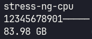

# ditana-print-system-load

This package provides a script to display system load and resource usage in the XFCE panel of Ditana GNU/Linux.

## Description

`ditana-print-system-load` is a utility that offers a concise yet informative view of your system’s current resource usage. It is designed to run unobtrusively in the XFCE panel, providing valuable insights at a glance.

The script displays three key pieces of information:

1. **Process Name**: When CPU usage exceeds a certain threshold, it shows the name of the process causing the highest load.
2. **CPU Load Visualization**: A text-based graphical bar representing the load on physical CPU cores.
3. **Free RAM**: The amount of available RAM in GB.



In this example, 11 physical cores are utilitized (caused by `stress-ng -c 11`). As CPU usage increases, you’ll see the "bar" fill up from left to right, providing an intuitive visual cue of system load. A completely filled bar indicates that all physical cores are fully utilized.
If there are more than 9 physical cores, the digits start at 0 again.

## Unique Approach to CPU Load Visualization

Unlike many system monitors that display virtual core usage, this tool focuses on physical core utilization. This approach provides a more accurate representation of actual CPU resource consumption.

### Technical Background

Modern CPUs often use technologies like Hyperthreading or Simultaneous Multithreading (SMT) to provide virtual cores, which can improve performance in many scenarios. However, it’s important to understand that virtual cores do not represent additional physical processing units.

For example, on a system with 16 physical cores and 32 virtual cores (including SMT), full utilization of the physical cores doesn’t mean that the remaining virtual cores can provide an additional 50% processing capacity. The relationship between physical and virtual core performance is complex and depends on various factors including the specific workload and CPU architecture.

By visualizing physical core usage, this tool gives you a clearer picture of your CPU’s actual workload. This can be particularly useful for understanding system performance, identifying bottlenecks, and making informed decisions about resource allocation or hardware upgrades.

## Usage

This package is a dependency of [ditana-config-xfce](https://github.com/acrion/ditana-config-xfce) and is installed by default when setting up a desktop environment in Ditana. The script’s output is continuously displayed in the XFCE panel.

To run the script manually:

```bash
/usr/share/ditana/print-system-load.sh
```

## Dependencies

- util-linux

## Installation

This package is typically installed as part of the Ditana desktop environment. For manual installation:

For more information about Ditana GNU/Linux, visit [https://ditana.org](https://ditana.org)
